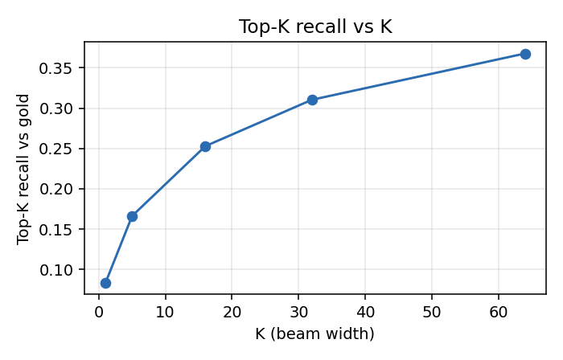
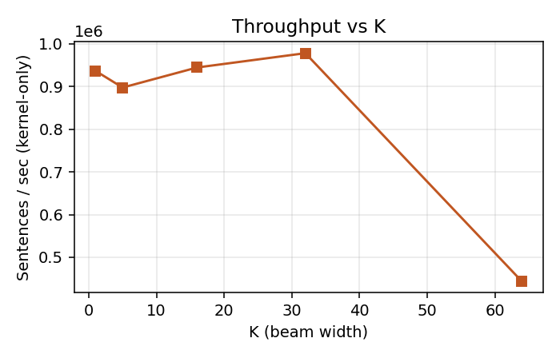

# cuSHR Batched (K3 + K5) Benchmark — Week 8

A100 (Lonestar6), whole SIGHUM corpus: 119,503 sentences / 4,488,155 nodes.
Job `batched_full.o3297178`.

## Results

**Correctness:** SCORE-EQUIVALENT to CPU at every K, checked on all 119,503 sentences.

## Throughput and memory vs K

| K | sent/sec (kernel) | µs/sent (kernel) | µs/sent (loop) | table MB | used MB |
|---|------------------:|-----------------:|---------------:|---------:|--------:|
| 1 | 936194 | 1.1 | 1.1 | 68.5 | 72.0 |
| 5 | 897267 | 1.1 | 1.1 | 273.9 | 276.0 |
| 16 | 944192 | 1.1 | 1.1 | 838.9 | 840.0 |
| 32 | 977700 | 1.0 | 1.0 | 1660.7 | 1662.0 |
| 64 | 443596 | 2.3 | 2.3 | 3304.3 | 3306.0 |

## Launch count (batched sweep)

| K | chunks | launches | sentences / launch |
|---|-------:|---------:|-------------------:|
| 1 | 1 | 50 | 2390 |
| 5 | 1 | 50 | 2390 |
| 16 | 1 | 50 | 2390 |
| 32 | 1 | 50 | 2390 |
| 64 | 1 | 50 | 2390 |

K2 launches the same kernel **1,205,796** times for the same corpus (one launch per
non-source level per sentence). K3 does it in **50** — a 24,116x reduction.

## Batch-size sweep (memory vs speed)

### Peak device memory (used MB)

| batch | chunks | launches | K=1 | K=5 | K=16 | K=32 | K=64 |
|---|-------:|---------:|------:|------:|------:|------:|------:|
| 256 | 467 | 10126 | 2 | 2 | 4 | 6 | 14 |
| 1024 | 117 | 3139 | 2 | 4 | 14 | 20 | 38 |
| 4096 | 30 | 1003 | 4 | 14 | 38 | 68 | 128 |
| -1 (whole corpus) | 1 | 50 | 72 | 276 | 840 | 1662 | 3306 |

### Throughput (sent/sec, kernel)

| batch | chunks | launches | K=1 | K=5 | K=16 | K=32 | K=64 |
|---|-------:|---------:|------:|------:|------:|------:|------:|
| 256 | 467 | 10126 | 78114 | 74664 | 77347 | 80332 | 32147 |
| 1024 | 117 | 3139 | 170719 | 169379 | 180651 | 177572 | 74903 |
| 4096 | 30 | 1003 | 331754 | 323681 | 357029 | 364633 | 162631 |
| -1 (whole corpus) | 1 | 50 | 936194 | 897267 | 944192 | 977700 | 443596 |

## Top-K recall vs gold

All 119,503 sentences checked; 59,092 carry a resolved gold path.
Identical to K2 at every K, as required by score-equivalence.

| K | K3/K5 recall@K | K2 recall@K |
|---|---------------:|------------:|
| 1 | 0.083125 | 0.083125 |
| 5 | 0.166283 | 0.166283 |
| 16 | 0.252894 | 0.252894 |
| 32 | 0.310448 | 0.310448 |
| 64 | 0.367867 | 0.367867 |

