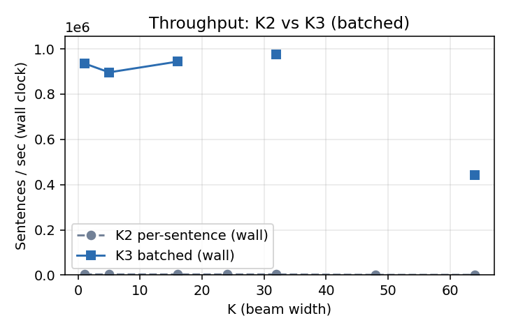
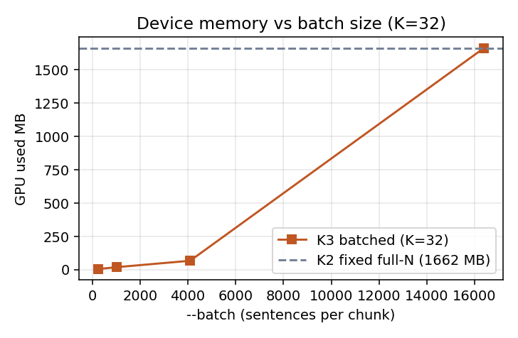

# K2 (per-sentence) vs K3/K5 (batched) — Improvement

Auto-generated by `compare_k2_k3.py`. Leads with **wall-clock** throughput, because the batched win is the elimination of per-sentence launch/sync overhead — kernel-only timing excludes that overhead and looks ~identical between the two.

## Throughput — wall clock (the headline)

| K | K2 wall µs/sent | K3 wall µs/sent | **wall speedup** | K2 sent/sec (wall) | K3 sent/sec (wall) |
|---|----------------:|----------------:|-----------------:|-------------------:|-------------------:|
| 1 | 341.0 | 1.1 | 319.0x | 2933 | 935454 |
| 5 | 342.4 | 1.1 | 306.8x | 2921 | 896057 |
| 16 | 343.0 | 1.1 | 323.6x | 2915 | 943396 |
| 24 | 343.9 | — | — | 2908 | — |
| 32 | 342.3 | 1.0 | 334.2x | 2922 | 976562 |
| 48 | 845.6 | — | — | 1183 | — |
| 64 | 844.3 | 2.3 | 374.2x | 1184 | 443262 |

## Throughput — kernel only (occupancy win)

Total merge *work* is identical, but K2 launches one tiny grid per sentence (Week-7 Nsight measured ~4.7% occupancy at K=32), so the A100 is starved. K3's cross-sentence launches saturate the GPU, so kernel-only throughput improves too — separately from the launch-overhead removal that the wall numbers above capture.

| K | K2 kernel µs/sent | K3 kernel µs/sent | kernel speedup |
|---|------------------:|------------------:|---------------:|
| 1 | 212.8 | 1.1 | 199.28x |
| 5 | 213.9 | 1.1 | 192.05x |
| 16 | 214.9 | 1.1 | 202.95x |
| 24 | 215.2 | — | — |
| 32 | 214.8 | 1.0 | 210.00x |
| 48 | 717.3 | — | — |
| 64 | 716.4 | 2.3 | 317.83x |

## Memory — fixed full-corpus (K2) vs chunked (K3)

K2 always allocates the whole-corpus top-K table. K3's `--batch N` sizes the table to one chunk, so device memory scales with the batch — run the full corpus within a fixed footprint.

| K | K2 used MB (full-N) | K3 used MB (batch=-1) | table MB @K2 | table MB @K3 |
|---|--------------------:|----------------------:|-------------:|-------------:|
| 1 | 72.0 | 72.0 | 68.5 | 68.5 |
| 5 | 276.0 | 276.0 | 273.9 | 273.9 |
| 16 | 840.0 | 840.0 | 838.9 | 838.9 |
| 24 | 1254.0 | — | 1249.8 | — |
| 32 | 1662.0 | 1662.0 | 1660.7 | 1660.7 |
| 48 | 2484.0 | — | 2482.5 | — |
| 64 | 3306.0 | 3306.0 | 3304.3 | 3304.3 |

### Memory vs batch size (K3, K=32)

Shows the chunked footprint shrinking as `--batch` drops, against K2's fixed full-corpus allocation.

| batch | K3 used MB (K=32) |
|------:|------------------:|
| 256 | 6.0 |
| 1024 | 20.0 |
| 4096 | 68.0 |
| 119503 | 1662.0 |

