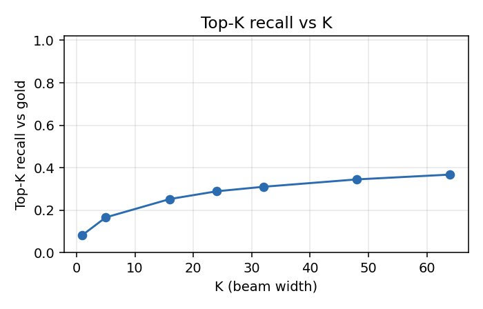
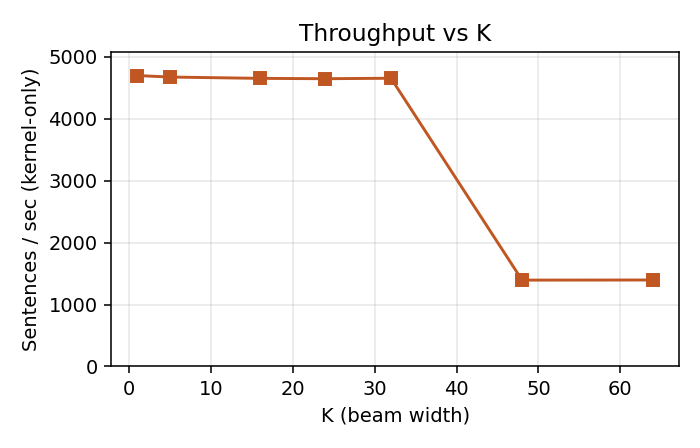

# cuSHR K-best (K2) Benchmark — Week 7 (CP-4)

Warp-level k-best merge kernel (`kbest_merge_level`) benchmarked over the SIGHUM dataset. Kernel-only timing uses CUDA events around each per-level merge launch (no H2D / reconstruction overhead). Correctness is checked against the Week-3 CPU `TopKDecoder` at the same K.

**Correctness:** SCORE-EQUIVALENT to CPU at every K (checked sentence count not recorded in this CSV).

## Throughput and memory vs K

| K | sent/sec (kernel) | µs/sent (kernel) | µs/sent (loop) | table MB | used MB |
|---|------------------:|-----------------:|---------------:|---------:|--------:|
| 1 | 4698 | 212.8 | 341.0 | 68.5 | 72.0 |
| 5 | 4674 | 213.9 | 342.4 | 273.9 | 276.0 |
| 16 | 4653 | 214.9 | 343.0 | 838.9 | 840.0 |
| 24 | 4647 | 215.2 | 343.9 | 1249.8 | 1254.0 |
| 32 | 4655 | 214.8 | 342.3 | 1660.7 | 1662.0 |
| 48 | 1394 | 717.3 | 845.6 | 2482.5 | 2484.0 |
| 64 | 1396 | 716.4 | 844.3 | 3304.3 | 3306.0 |

## Top-K recall vs gold

Measured over the 59092 checked sentences that carry a resolved gold path.

| K | recall@K |
|---|---------:|
| 1 | 0.0831 |
| 5 | 0.1663 |
| 16 | 0.2529 |
| 24 | 0.2892 |
| 32 | 0.3104 |
| 48 | 0.3452 |
| 64 | 0.3679 |

## Nsight Compute summary

| K | occupancy % | DRAM throughput % | top warp-stall reasons |
|---|------------:|------------------:|------------------------|
| 32 | 4.7 | 0.0 | wait (3.32); long_scoreboard (2.81) |
| 64 | 4.5 | 0.0 | wait (3.31); long_scoreboard (1.26) |

_Occupancy = `sm__warps_active` % of peak; DRAM % = `dram__throughput` % of peak sustained. Stall values are avg warps stalled per active cycle for that reason._
