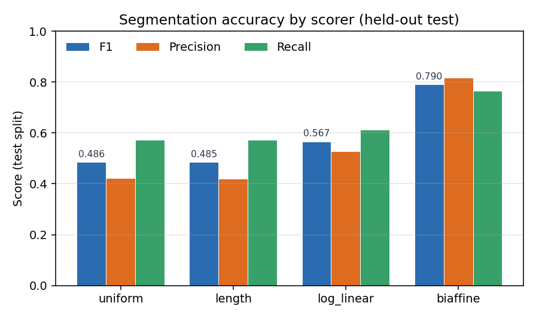
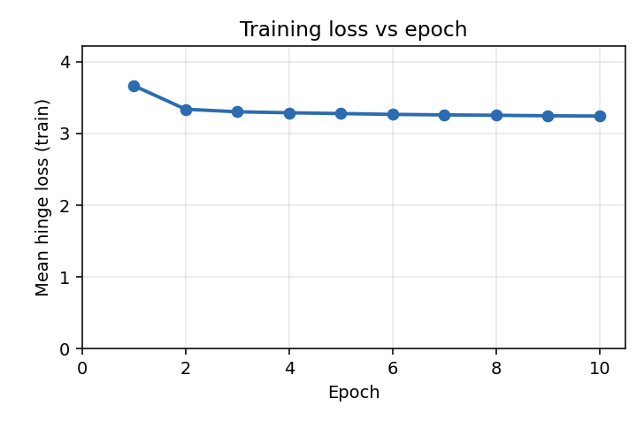
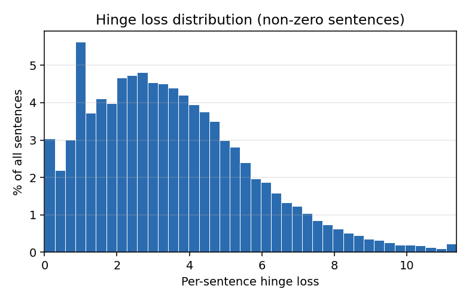

# Learned Scoring Function

A trained `BiaffineEdgeScorer` that produces edge scores.


## Pipeline

```
# 1. choose a featurization (see "Featurizers" below)
python build_features.py --featurizer scalars64 \
    --raw ../data/new_cushr_data_full_with_gold.npz \
    --out ../data/features_scalars64.npz

# 2. split + cache
python prepare.py --npz ../data/features_scalars64.npz
python smoke_test.py                    # validates collate + viterbi
python baseline.py
python train.py --epochs 10 --batch 64
python export_weights.py --bin model_biaffine.bin --edge-scores edge_score.npy
python check_export.py

# use it in the CPU decoder:
../cushr_cpu/cushr_evaluate ../data/features_scalars64.npz \
    --scorer biaffine --model model_biaffine.bin --K 10
```

## The model

```
score(e = (u, v)) = <W_s x(u), W_d x(v)> + b
x(v) = node_features[v]        # verbatim; the featurizer decides the columns
```

## Featurizers

Featurization is a named component (`cushr_train/featurizers.py`), not a fixed
step. Every featurizer emits 64 columns, zero-padding if it has less to say, so
archives and kernels see one shape. `feat_dim` and the featurizer name travel
inside the `.npz` and the `.bin`, so training and the C++ decoder read them
rather than agreeing on a constant.

| name | what it adds |
|---|---|
| `morph43` | 43 morph one-hots + log1p(length). The pre-registry vector; regression baseline. |
| `scalars64` | `morph43` + length buckets, sentence/chunk position, corpus frequency, character-class rates. |
| `ngram_split` | Hellwig-style n-gram split probabilities. Registered but not implemented. |

Corpus statistics are fitted on the **training split only** — `build_features.py`
reproduces `prepare.py`'s md5 bucketing to determine it. Counting frequencies
over the whole corpus leaks test information into a feature and inflates dev
scores for free.

Note that changing featurizer changes the weight file's meaning. The `.bin`
magic is `CSB3`; older `CSB2` files (where the C++ scorer appended
`log1p(word_length)` itself) are rejected at load rather than silently
mis-scored.

## Results

Top-1, word-level:

| scorer | F1 | P | R |
|---|---|---|---|
| uniform | 0.4857 | 0.4217 | 0.5726 |
| length | 0.4848 | 0.4209 | 0.5716 |
| log_linear | 0.5666 | 0.5276 | 0.6118 |
| biaffine | 0.7904 | 0.8175 | 0.7650 |
| biaffine + `scalars64` | 0.8534 | 0.8580 | 0.8487 |
| biaffine + `ngrams80` | 0.8543 | 0.8570 | 0.8515 |
| biaffine + `hybrid` | **0.8771** | **0.8795** | **0.8748** |

The `biaffine` row above is the `morph43` featurization; re-run through the
featurizer registry it reproduces at F1 0.7894. The remaining rows are rungs of
an ablation ladder: `scalars64` adds surface-derived scalars at the same
parameter count (+6.4 F1), `ngrams80` adds hashed character n-grams (+0.1, a
wash), and `hybrid` adds learned form/lemma/preverb embeddings (+2.3).

`hybrid` trains 1.2M embedding parameters but **decodes with an unchanged C++
scorer**: the tables are frozen after training and baked into a dense node
array, so no gather path or new file format is needed. See
[FEATURIZER_COMPARISON.md](FEATURIZER_COMPARISON.md) for the per-frequency-bucket
breakdown, the caveats, and how the materialization works.




### Training curve



### Max margin scores

