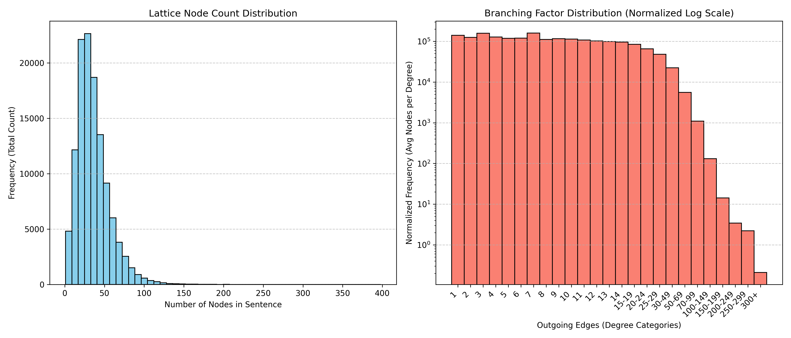

# cuSHR Dataset Statistics

**Total sentences:** 119,503  
**Total nodes:** 4,249,149  
**Total edges:** 59,336,952  

## 1. Lattice node count distribution
*How many candidate words are in a single sentence graph?*
* **Mean:** 35.56 nodes
* **Median:** 32.00 nodes
* **95th percentile:** 74.00 nodes
* **99th percentile:** 102.00 nodes
* **Max:** 398 nodes

## 2. Branching factor
*How many paths can you take from a given node?*
* **Average branching factor:** 13.9644 edges per node
* **Max branching factor:** 360 edges from a single node

## 3. Gold path length
*How many nodes make up the true, correct translation?*
* **Average gold path length:** 0.00 nodes
* **Max gold path length:** 0 nodes
*(note: if these values are 0, ground truth labels have not yet been mapped).*
